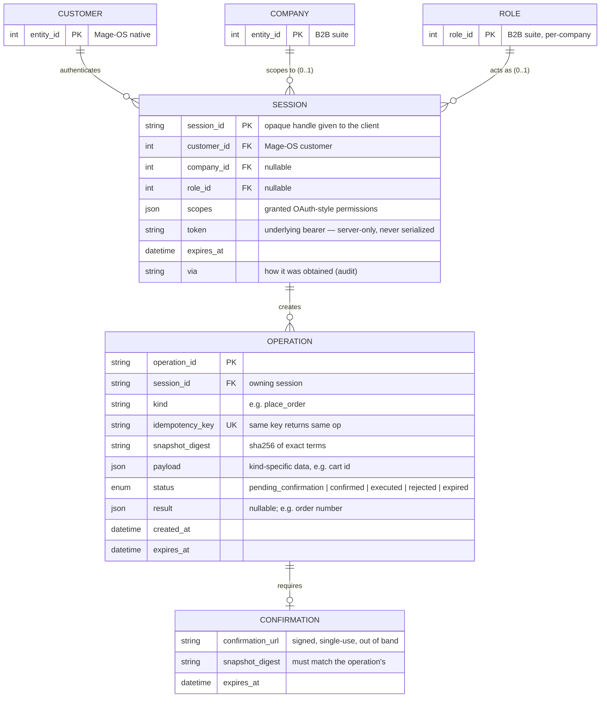
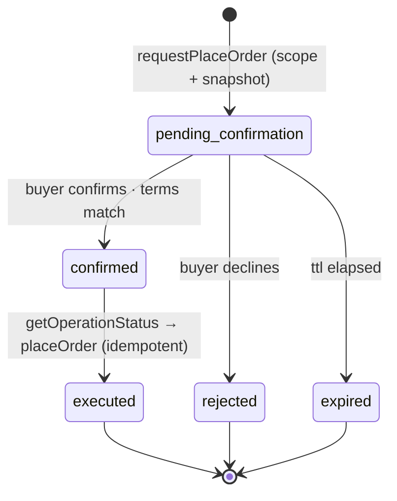

# B2B delegated-access — entity model

Documents the entities behind the MCP-side delegated-authorization and
confirmation model (`src/auth/`), their properties, and their relationships.
This is the data model of *slices 1 & 2* on the `b2b-delegated-auth` branch — the
scaffolding that lets an AI agent act on the store with scoped, revocable
authority and a human-confirmed order step.

> **Scope of truth.** These entities live in the MCP adapter. The authoritative
> customer, company, role and order records are Mage-OS's; the MCP never becomes
> a second source of truth. External (Mage-OS) entities are shown dashed in the
> relationships below and carry only the identifiers the adapter references.

## Entity–relationship diagram

## Entities

### Session — `ActorContext` (`actorContext.ts`, held by `sessionStore.ts`)

The server-side identity behind a session, built once from a verified credential
and never reconstructed from tool arguments.

| Property | Type | Notes |
|---|---|---|
| `sessionId` | string | Opaque handle returned to the client. Not a credential itself. |
| `customerId` | int | Authenticated Mage-OS customer. |
| `companyId` | int \| null | Company the token is scoped to; null for a non-company customer. |
| `roleId` | int \| null | The member's role within the company. |
| `scopes` | `Scope[]` | Granted permissions — the ceiling on what the agent may do. |
| `token` | string | Underlying Mage-OS bearer for downstream calls. **Server-only**; `safeView()` omits it. |
| `expiresAt` | epoch ms | After this the context is invalid and evicted. |
| `via` | string | Provider that issued it (`password-dev`, `delegated-oauth`) — for audit. |

### Operation (`operations.ts`, held by `OperationStore`)

An execute-tier action awaiting confirmation. Guarantees at-most-once execution.

| Property | Type | Notes |
|---|---|---|
| `operationId` | string | Primary key. |
| `sessionId` | string | The session that created it; only that session may read it. |
| `kind` | string | The action, e.g. `place_order`. |
| `idempotencyKey` | string | Caller-supplied. A replay returns the same operation; a replay with *different* terms is a conflict. |
| `snapshotDigest` | string | `sha256` of the exact terms; the buyer confirms *this*. |
| `payload` | json | Kind-specific data needed to execute (e.g. `cartId`). |
| `status` | enum | See the state machine below. |
| `result` | json \| null | Set once executed (e.g. `{ order_number }`). |
| `createdAt` / `expiresAt` | epoch ms | Pending operations expire after their window. |

### Confirmation (`confirmation.ts` — a seam, not a stored table)

Issued by the `ConfirmationProvider` for one operation: a signed, single-use link
the agent presents out of band and the buyer opens in their own session, bound to
the operation and its `snapshotDigest`.

### Value objects

- **`Scope`** — an OAuth-style permission string in one of three tiers:
  **Read** (`company.read`, `catalog.read`, `pricing.read`, `orders.read.own`,
  `orders.read.company`, `credit.read`), **Draft** (`cart.draft`,
  `lists.manage.own`, `lists.manage.company`), **Execute** (`purchase.propose`,
  `purchase.execute`, `quote.accept`). These are **not** Magento store scope
  (website/store-view) — that is a separate axis carried by the `Store` header.
- **`OperationStatus`** — the enum below.

## Operation state machine

Only `pending_confirmation → confirmed → executed` is the success path. A
repeated or timed-out poll re-enters `executed` idempotently and never places a
second order.

## Seams (the pluggable boundaries)

| Seam | Interface | Dev stand-in | Production |
|---|---|---|---|
| Credential → context | `AuthProvider` | `PasswordAuthProvider` (dev-only, read-only scopes) | `DelegatedAuthProvider` + a `TokenVerifier` (authenticated account binding) |
| Buyer confirmation | `ConfirmationProvider` | `StubConfirmationProvider` | store-hosted signed-link page |
| Context storage | `SessionStore` | in-memory | externalized (survives restarts, spans workers) |
| Operation storage | `OperationStore` | in-memory | externalized (find outcome after timeout) |

See [`b2b-mcp-requirements.md`](b2b-mcp-requirements.md) for how these map to the
RFC's MCP requirements and what's still open.
